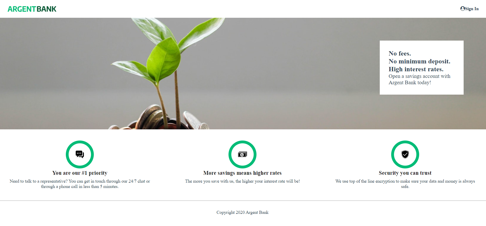

# Argent-Bank-front-end



## Installation

1. To clone the Front-end project repo and be able to add your code, please enter the following command:

```
git clone https://github.com/FaridBF/argent-bank-front-end.git
```

2. Prerequisites

- [NodeJS (version 14.17)](https://nodejs.org/en/)

3. Install all dependencies with the following command:

```
npm install
```

## List of dependencies that will be installed:

- [React.js](https://fr.reactjs.org/) is a JavaScript library for building user interfaces.
- [React-router-dom](https://www.npmjs.com/package/react-router-dom) is a package used to create links for using React Router in web applications.
- [Redux-toolkit](https://www.npmjs.com/package/@reduxjs/toolkit) The Redux Toolkit package is intended to be the standard way to write Redux logic.
- [Axios](https://axios-http.com/fr/docs/intro) is a JavaScript module used for making HTTP requests (GET, POST, PUT, etc.).
- [Swagger-ui-react](https://www.npmjs.com/package/swagger-ui-react) Swagger is an open-source toolset for designing, building, documenting, and consuming RESTful web services.
- [YAML](https://www.npmjs.com/package/yaml) YAML (YAML Ain't Markup Language) is a human-readable data serialization format commonly used for configuration files, data exchange, and storing structured data. It offers a concise and easily readable syntax, making it convenient for both humans and machines to work with and interpret data.

4. Launch the project with the following command:

```
npm start
```

## Route for accessing the swagger Interface Contract

```
/swagger
```

## Additional tools used to create this project:

- [Les Hooks](https://fr.reactjs.org/docs/hooks-state.html) provide the ability to use local state and other React features without having to write classes (available since React 16.8).
- [Notion](https://www.notion.so/) is a project management and note-taking tool that allows users to collaborate on projects and integrate them with other tools such as Trello, Kanban, etc...
- [JSDoc](https://jsdoc.app/) is a tool that allows you to generate documentation from JavaScript code. It uses special documentation comments in the source code to generate HTML documentation pages or JSON files.
- [Visual Studio Code](https://code.visualstudio.com/) is a source code editor used by developers to improve productivity and efficiency during software development.
